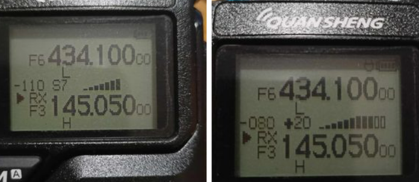
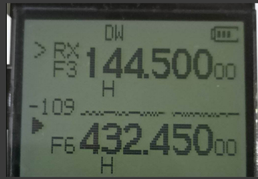

# UV_K5_playground
## src/spectrum 
  
Spectrum scanner. It prints a spectrum graph that covers +/- 1 MHz from the center frequency. Prints center frequency, and frequency with highest amplitude.

* download mod [uv_k5_01_26_spectrum_2MHz_encoded.bin](https://github.com/piotr022/UV_K5_playground/releases/latest)
* to enable spectum view press flash light button
* use *up* and *down* key to change center frequency
* press *PTT* to disable spectrum view

Please, consider paying tribute to the two fallen Quashengs that were bricked during the development process. Their sacrifice played a crucial role in shaping this project. To show your appreciation and support for our ongoing work, you can make a [donation](https://paypal.me/sq9p).

## src/rssi_sbar 
  
sbar with calibrated S steps
* download mod [uv_k5_01_26_rssi_sbar_encoded.bin](https://github.com/piotr022/UV_K5_playground/releases/latest)
* flash with original quansheng update tool

## src/rssi_printer 
  
mod for printing rx signal level (RSSI) in numerical format, also includes small signal level chart.
### uploading to radio
* download mod [uv_k5_01_26_rssi_printer_encoded.bin](https://github.com/piotr022/UV_K5_playground/releases/latest)
* upload it through original firmware update tool:  
[Quancheng website](http://en.qsfj.com/support/downloads/3002)  

## src/pong 
  
this is useless 
* download mod [uv_k5_01_26_pong_game_encoded.bin](https://github.com/piotr022/UV_K5_playground/releases/latest)

## flash masking and memory layout
Chinese mcu DP32G030 has feature called flash masking, here is how it works:

## libs/k5_uv_system (par_runner)
The idea is to run this firmware 'parallel' with the original Quencheng firmware. This can be achieved by relocating the original vector table to the end of the original firmware, and placing a new vector table at the beginning, with entities pointing to the par_runner functions that wrap the original firmware handlers.  
Every interrupt is first processed by the par_runner handlers, which can perform tasks like responding to a button press(todo), before invoking the original firmware handler
#### flash memory layout
When building the "par_runner" target automaticly "bootloader" target will be build

building par_runner target will result in following outputs:
* par_runner.bin / .hex - right part of image, can be used to generate encrypted firmware compatible with orginal Quescheng update tool
* bootloader.bin - stripped bootloader from orginal firmware
* par_runner_with_bootloader.bin - complete firmware image

To change the original firmware that will be wrapped and placed into the original firmware section, replace `./original_fw/original_fw.bin` or set the variable 
```CMakeLists.txt set(ORGINAL_FW_BIN orginal_fw.bin)```
in ./orginal_fw/CMakeLists.txt
and rebuild par_runner

## build system installation
currently tested on windows, requred:
* arm-none-eabi-gcc
* python (i have newest version)
* cmake
* ninja
* open-ocd

All folders with executables of the above programs should be added to the PATH environment variable.

for debugging:
* vs code
  * Cortex-Debug plugin
  * CMake plugin

### building
##### via terminal
```$ mkdir build```
```$ cd build```
```$ cmake ../ -G Ninja```
```$ ninja par_runner```
outputs ./build/src/par_runner/par_runner.bin / hex / elf
###### uploading
```$ ninja par_runner_flash```

##### via VS Code
Select the par_runner build target in the bottom bar and press build.
###### uploading
Enter the 'Run & Debug' tab, select 'kwaczek DBG', and press run.

## useful links
* currently firmare that is wrapped by par_runner comes from Tunas1337 mod 
k5_26_encrypted_18to1300MHz.bin [UV-K5-Modded-Firmwares](https://github.com/Tunas1337/UV-K5-Modded-Firmwares)  
* crypting/encrypting/modding py tools [amnemonic repo](https://github.com/amnemonic/Quansheng_UV-K5_Firmware)  

## Warning
I'm not responsible for radios bricked by this trojan xD